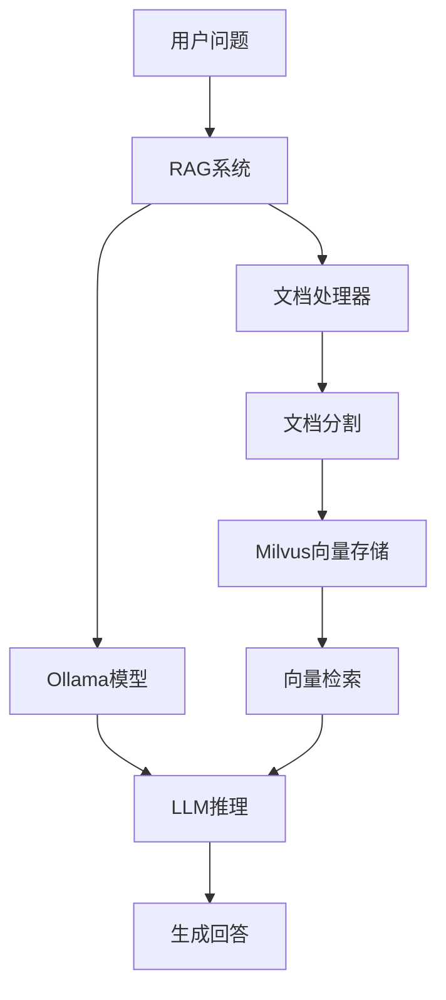

# LlamaIndex RAG 系统

基于 LlamaIndex 和 Milvus 构建的检索增强生成(RAG)问答系统，使用 Ollama 提供的本地大语言模型。

## 📋 项目概述

本项目实现了一个完整的 RAG 系统，能够：
- 从本地文档中提取和分割文本内容
- 使用嵌入模型将文本转换为向量表示
- 将向量存储在 Milvus 向量数据库中
- 通过语义搜索检索相关文档片段
- 使用大语言模型生成基于检索内容的回答

## 🛠 运行环境要求

### 系统要求
- Python 3.8 或更高版本
- macOS/Linux/Windows (推荐 macOS 或 Linux)
- 至少 8GB RAM (推荐 16GB 或更多)
- 至少 20GB 可用磁盘空间

### 依赖服务
1. **Ollama** - 本地大语言模型服务
2. **Milvus** - 向量数据库

### Python 依赖包
- llama-index-core>=0.10.0
- llama-index-llms-ollama>=0.1.0
- llama-index-embeddings-ollama>=0.1.0
- llama-index-vector-stores-milvus>=0.1.0
- pymilvus>=2.4.0
- langfuse (可选，用于监控)
- chromadb (可选)

## 🚀 安装与配置

### 1. 安装 Ollama
```bash
# macOS
brew install ollama

# Linux
curl -fsSL https://ollama.com/install.sh | sh

# Windows
访问 https://ollama.com/download/OllamaSetup.exe 下载安装
```


### 2. 拉取所需模型
```bash
# 拉取语言模型
ollama pull llama3

# 拉取嵌入模型
ollama pull nomic-embed-text
```


### 3. 安装 Milvus
推荐使用 Docker 方式安装:
```bash
# 使用 Docker Compose 启动 Milvus
wget https://github.com/milvus-io/milvus/releases/download/v2.4.9/milvus-standalone-docker-compose.yml -O docker-compose.yml
docker-compose up -d
```


### 4. 安装 Python 依赖
```bash
pip install llama-index-core
pip install llama-index-llms-ollama
pip install llama-index-embeddings-ollama
pip install llama-index-vector-stores-milvus
pip install pymilvus
pip install langfuse openinference-instrumentation-llama-index python-dotenv llama-index
```


### 5. 准备数据文件
在项目目录下创建 `data` 文件夹，并放入要处理的文本文件:

## 📁 项目结构
```
LlamaIdex/
├── main.py                 # 程序入口文件
├── logger.py               # 日志管理模块
├── model_manager.py        # 模型管理模块
├── milvus_manager.py       # Milvus 数据库管理模块
├── document_processor.py    # 文档处理模块
├── AdvancedLlamaDebugMonitor.py # 高级调试监控模块
├── rag_system.py           # RAG 系统主控制模块
├── monitoring_mode.py      # 监控模式管理模块
├── lang_fuse.py            # Langfuse 监控集成模块
├── config_manager.py       # 配置管理模块
├── config/                 # 配置文件目录
│   └── config.ini          # 系统配置文件
├── data/                   # 文档数据目录
│   └── yiyan.txt           # 示例文档文件
└── README.md               # 项目说明文档
```


## ⚙️ 配置说明

### 配置文件 (config.ini)
项目使用统一的配置文件来管理所有设置:

```ini
[Milvus]
host = 127.0.0.1           # Milvus 服务地址
port = 19530               # Milvus 服务端口
collection_name = ragdb    # 集合名称
database_name = rag_database # 数据库名称

[Model]
llm_model = llama3         # LLM 模型名称
embedding_model = nomic-embed-text # 嵌入模型名称
ollama_base_url = http://127.0.0.1:11434 # Ollama 服务地址
request_timeout = 120.0    # 请求超时时间

[Document]
file_path = /Users/liuguanghu/PythonPorject/LlamaIdex/data/yiyan.txt # 文档路径
chunk_size = 500           # 文本分块大小
chunk_overlap = 20         # 文本重叠大小

[App]
default_dim = 768          # 默认嵌入维度

[Langfuse]
public_key = pk-lf-...     # Langfuse 公钥
secret_key = sk-lf-...     # Langfuse 私钥
host = https://cloud.langfuse.com # Langfuse 服务地址
```


### 监控模式配置
系统支持两种监控模式:
1. **Debug 模式** - 使用内置调试监控器
2. **Langfuse 模式** - 使用 Langfuse 云监控服务

通过命令行参数切换:
```bash
python main.py --monitor-mode debug    # 使用 Debug 模式
python main.py --monitor-mode langfuse # 使用 Langfuse 模式
```


## ▶️ 运行程序

### 启动依赖服务
```bash
# 启动 Ollama 服务
ollama serve

# 启动 Milvus (如果使用 Docker)
docker-compose up -d
```


### 运行主程序
```bash
python main.py [--monitor-mode {debug,langfuse}]
```


## 🎮 使用方法

程序启动后会显示:
```
[时间] [INFO] 欢迎使用AI助手！输入 'exit' 退出程序。
问题：
```


输入你的问题，系统会:
1. 在向量数据库中搜索相关内容
2. 使用大语言模型生成基于检索内容的回答
3. 显示回答和来源信息

示例:
```
问题：什么是人工智能？
AI助手：人工智能是计算机科学的一个分支，它企图了解智能的实质...
```


输入 `exit` 退出程序。

## 🔧 故障排除

### 常见问题

1. **Ollama 模型未找到**
   ```
   解决方法: ollama pull llama3
   ```


2. **无法连接到 Milvus**
   ```
   检查: docker-compose ps
   启动: docker-compose up -d
   ```


3. **嵌入维度不匹配**
   ```
   解决方法: 检查嵌入模型维度并在 Milvus 集合中设置相同维度
   ```


4. **文档文件不存在**
   ```
   解决方法: 确保 data/yiyan.txt 文件存在或修改配置文件中的路径
   ```


5. **Langfuse 认证失败**
   ```
   解决方法: 检查 config.ini 中的 Langfuse 配置是否正确
   ```


### 日志查看
程序会输出详细的执行日志，帮助诊断问题:
- `[INFO]` - 正常信息
- `[WARNING]` - 警告信息
- `[ERROR]` - 错误信息

## 📈 系统架构



## 📊 监控功能

### Debug 监控模式
提供详细的本地调试信息:
- 文本分割事件监控
- 节点解析事件监控
- 文本嵌入事件监控
- 查询引擎事件监控
- 语义检索事件监控

### Langfuse 监控模式
集成 Langfuse 云监控服务:
- Trace 追踪
- Span 性能分析
- 模型调用监控
- 系统性能指标

## 🔒 安全建议

1. **密钥管理**
   - 不要在代码中硬编码密钥
   - 使用配置文件管理敏感信息
   - 确保配置文件不在版本控制系统中

2. **访问控制**
   - 限制对 Milvus 数据库的访问
   - 使用防火墙保护服务端口
   - 定期更新依赖包

3. **数据保护**
   - 定期备份向量数据库
   - 加密敏感数据传输
   - 监控异常访问行为