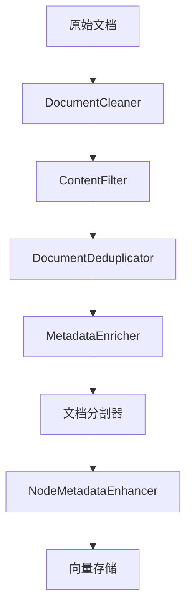

# LlamaIndex RAG 系统

基于 LlamaIndex 和 Milvus 构建的检索增强生成(RAG)问答系统，使用 Ollama 提供的本地大语言模型。

## 📋 项目概述

本项目实现了一个完整的 RAG 系统，能够：

- 从本地文档中提取和分割文本内容
- 使用嵌入模型将文本转换为向量表示
- 将向量存储在 Milvus 向量数据库中
- 通过语义搜索检索相关文档片段
- 使用大语言模型生成基于检索内容的回答

## 🛠 运行环境要求

### 系统要求

- Python 3.13 或更高版本
- macOS/Linux/Windows (推荐 macOS 或 Linux)
- 至少 8GB RAM (推荐 16GB 或更多)
- 至少 20GB 可用磁盘空间

### 依赖服务

1. **Ollama** - 本地大语言模型服务
2. **Milvus** - 向量数据库

### Python 依赖包

- llama-index-core>=0.10.0
- llama-index-llms-ollama>=0.1.0
- llama-index-embeddings-ollama>=0.1.0
- llama-index-vector-stores-milvus>=0.1.0
- pymilvus>=2.4.0
- langfuse (可选，用于监控)
- chromadb (可选)

## 🚀 安装与配置

### 1. 安装 Ollama

```bash
# macOS
brew install ollama

# Linux
curl -fsSL https://ollama.com/install.sh | sh

# Windows
访问 https://ollama.com/download/OllamaSetup.exe 下载安装
```

### 2. 拉取所需模型

```bash
# 拉取语言模型
ollama pull llama3

# 拉取嵌入模型
ollama pull nomic-embed-text
```

### 3. 安装 Milvus

推荐使用 Docker 方式安装:

```bash
# 使用 Docker Compose 启动 Milvus
wget https://github.com/milvus-io/milvus/releases/download/v2.4.9/milvus-standalone-docker-compose.yml -O docker-compose.yml
docker-compose up -d
```

### 4. 安装 Python 依赖

```bash
pip install llama-index-core
pip install llama-index-llms-ollama
pip install llama-index-embeddings-ollama
pip install llama-index-vector-stores-milvus
pip install pymilvus
pip install langfuse openinference-instrumentation-llama-index python-dotenv llama-index
pip install llama-index-readers-web
```

### 5. 准备数据文件

在项目目录下创建 `data` 文件夹，并放入要处理的文本文件:

## 📁 项目结构

```
LlamaIdex/
├── main.py                 # 程序入口文件
├── logger.py               # 日志管理模块
├── model_manager.py        # 模型管理模块
├── milvus_manager.py       # Milvus 数据库管理模块
├── document_processor.py    # 文档处理模块
├── AdvancedLlamaDebugMonitor.py # 高级调试监控模块
├── rag_system.py           # RAG 系统主控制模块
├── monitoring_mode.py      # 监控模式管理模块
├── lang_fuse.py            # Langfuse 监控集成模块
├── config_manager.py       # 配置管理模块
├── prompts.py              # 提示模版管理模块
├── config/                 # 配置文件目录
│   └── config.ini          # 系统配置文件
├── data/                   # 文档数据目录
│   └── yiyan.txt           # 示例文档文件
└── README.md               # 项目说明文档
```

## ⚙️ 配置说明

### 配置文件 (config.ini)

项目使用统一的配置文件来管理所有设置:

```ini
[Milvus]
host = 127.0.0.1           # Milvus 服务地址
port = 19530               # Milvus 服务端口
collection_name = ragdb    # 集合名称
database_name = rag_database # 数据库名称

[Model]
llm_model = llama3         # LLM 模型名称
embedding_model = nomic-embed-text # 嵌入模型名称
ollama_base_url = http://127.0.0.1:11434 # Ollama 服务地址
request_timeout = 120.0    # 请求超时时间

[Document]
file_path = /Users/liuguanghu/PythonPorject/LlamaIdex/data/yiyan.txt # 文档路径
chunk_size = 500           # 文本分块大小
chunk_overlap = 20         # 文本重叠大小

[App]
default_dim = 768          # 默认嵌入维度
qa_template = technical    # 默认问答模板类型

[Langfuse]
public_key = pk-lf-...     # Langfuse 公钥
secret_key = sk-lf-...     # Langfuse 私钥
host = https://cloud.langfuse.com # Langfuse 服务地址
```

### 监控模式配置

系统支持两种监控模式:

1. **Debug 模式** - 使用内置调试监控器
2. **Langfuse 模式** - 使用 Langfuse 云监控服务

通过命令行参数切换:

```bash
python main.py --monitor-mode debug    # 使用 Debug 模式
python main.py --monitor-mode langfuse # 使用 Langfuse 模式
```

## ▶️ 运行程序

### 启动依赖服务

```bash
# 启动 Ollama 服务
ollama serve

# 启动 Milvus (如果使用 Docker)
docker-compose up -d
```

### 运行主程序

```bash
python main.py [--monitor-mode {debug,langfuse}]
```

## 🎮 使用方法

程序启动后会显示:

```
[时间] [INFO] 欢迎使用AI助手！输入 'exit' 退出程序。
问题：
```

输入你的问题，系统会:

1. 在向量数据库中搜索相关内容
2. 使用大语言模型生成基于检索内容的回答
3. 显示回答和来源信息

示例:

```
问题：什么是人工智能？
AI助手：人工智能是计算机科学的一个分支，它企图了解智能的实质...
```

输入 `exit` 退出程序。

## 🔧 故障排除

### 常见问题

1. **Ollama 模型未找到**

   ```
   解决方法: ollama pull llama3
   ```

2. **无法连接到 Milvus**

   ```
   检查: docker-compose ps
   启动: docker-compose up -d
   ```

3. **嵌入维度不匹配**

   ```
   解决方法: 检查嵌入模型维度并在 Milvus 集合中设置相同维度
   ```

4. **文档文件不存在**

   ```
   解决方法: 确保 data/yiyan.txt 文件存在或修改配置文件中的路径
   ```

5. **Langfuse 认证失败**

   ```
   解决方法: 检查 config.ini 中的 Langfuse 配置是否正确
   ```

### 日志查看

程序会输出详细的执行日志，帮助诊断问题:

- `[INFO]` - 正常信息
- `[WARNING]` - 警告信息
- `[ERROR]` - 错误信息

## 📈 系统架构


## 📊 监控功能

### Debug 监控模式

提供详细的本地调试信息:

- 文本分割事件监控
- 节点解析事件监控
- 文本嵌入事件监控
- 查询引擎事件监控
- 语义检索事件监控

### Langfuse 监控模式

集成 Langfuse 云监控服务:

- Trace 追踪
- Span 性能分析
- 模型调用监控
- 系统性能指标
基于系统中可用的分割器类型，我将为 README.md 文件增加详细的分割器类型说明：

## 📐 分割器类型详解

系统支持多种文档分割器，可根据不同文档类型和应用场景选择合适的分割策略：

### 1. 基础文本分割器

#### `SentenceSplitter`
- **用途**: 基于句子边界分割文本，保持语义完整性
- **适用场景**: 通用文本处理，常规文档分割
- **特点**: 按照标点符号识别句子边界，避免语义截断

#### `TokenTextSplitter`
- **用途**: 基于token计数进行文本分割
- **适用场景**: 需要精确控制token数量的情况（如大模型输入长度限制）
- **特点**: 更精确地控制文本块大小，适合对token预算有严格要求的场景

### 2. 代码分割器

#### `CodeSplitter`
- **用途**: 专门用于代码文件的分割
- **适用场景**: 处理源代码文件（Python, JavaScript, Java等）
- **特点**: 识别代码语法结构，避免在函数或类定义中间分割

### 3. 结构化文档分割器

#### `MarkdownNodeParser`
- **用途**: Markdown格式文档专用解析器
- **适用场景**: 处理.md文件，保留Markdown结构信息
- **特点**: 识别标题、代码块、列表等Markdown元素

#### `HTMLNodeParser`
- **用途**: HTML格式文档专用解析器
- **适用场景**: 处理网页内容或HTML格式文档
- **特点**: 解析HTML标签结构，保留文档层次关系

#### `JSONNodeParser`
- **用途**: JSON格式数据专用解析器
- **适用场景**: 处理JSON结构化数据
- **特点**: 解析JSON对象和数组结构

### 4. 上下文感知分割器

#### `SentenceWindowNodeParser`
- **用途**: 创建包含上下文窗口的句子节点
- **适用场景**: 需要前后文信息的检索场景
- **特点**: 为每个句子节点附加前后若干句子作为上下文

### 5. 语义分割器

#### `SemanticSplitterNodeParser`
- **用途**: 基于语义相似度进行文本分割
- **适用场景**: 对语义连贯性要求较高的文档处理
- **特点**: 利用嵌入模型计算语义相似度，避免在语义不连贯处分割

#### `SemanticDoubleMergingSplitterNodeParser`
- **用途**: 双重语义合并分割器
- **适用场景**: 需要更精细语义分割的复杂文档
- **特点**: 采用双重合并策略，提供更准确的语义分割点

### 6. 层次化分割器

#### `HierarchicalNodeParser`
- **用途**: 创建多层次节点结构
- **适用场景**: 构建多粒度索引，支持不同层级的检索
- **特点**: 生成父-子节点关系，支持层次化查询

### 7. 特殊格式分割器

#### `MarkdownElementNodeParser`
- **用途**: Markdown元素解析器
- **适用场景**: 需要细粒度处理Markdown各元素的场景
- **特点**: 单独解析每个Markdown元素（标题、段落、代码块等）

#### `UnstructuredElementNodeParser`
- **用途**: 非结构化元素解析器
- **适用场景**: 处理复杂的非结构化文档
- **特点**: 支持表格、图像描述等复杂元素解析

### 8. 第三方集成分割器

#### `LangchainNodeParser`
- **用途**: 集成Langchain的节点解析器
- **适用场景**: 已使用Langchain生态的项目
- **特点**: 兼容Langchain的文档处理流程

## ⚙️ 分割器配置

在 [config.ini](file:///Users/liuguanghu/PythonPorject/LlamaIdex/config/config.ini) 文件中添加分割器配置：

```ini
[Document]
file_path = /Users/liuguanghu/PythonPorject/LlamaIdex/data/yiyan.txt
chunk_size = 500
chunk_overlap = 20
splitter_type = sentence  # 可选: sentence, token, code, markdown, html, json, sentence_window, semantic, hierarchical
```


## 🎯 分割器选择指南

| 文档类型 | 推荐分割器 | 理由 |
|---------|-----------|------|
| 普通文本 | `SentenceSplitter` | 保持语义完整性 |
| 技术文档 | `SemanticSplitterNodeParser` | 维持主题一致性 |
| 源代码 | `CodeSplitter` | 保持代码结构完整 |
| Markdown | `MarkdownNodeParser` | 保留文档结构 |
| 网页内容 | `HTMLNodeParser` | 解析HTML结构 |
| JSON数据 | `JSONNodeParser` | 处理结构化数据 |
| 需要上下文 | `SentenceWindowNodeParser` | 提供前后文信息 |
| 多层级检索 | `HierarchicalNodeParser` | 构建层次化索引 |

## 🔄 数据管道转换说明

系统采用模块化的数据管道架构，通过一系列转换器对原始文档进行预处理、清洗、增强和优化，以提高RAG系统的整体性能和准确性。

### 数据管道架构

数据管道基于 `llama_index.core.ingestion.IngestionPipeline` 构建，包含多个可插拔的转换组件，每个组件负责特定的数据处理任务。

### 转换器类型详解

#### 1. DocumentCleaner（文档清理器）
- **功能**：清理文档中的多余空白字符和空行
- **配置选项**：
  - `remove_extra_spaces`: 移除多余空白字符
  - `remove_empty_lines`: 移除空行
- **应用场景**：标准化文档格式，提高文本质量

#### 2. ContentFilter（内容过滤器）
- **功能**：根据长度过滤文档内容
- **配置选项**：
  - `min_length`: 最小文档长度
  - `max_length`: 最大文档长度
- **应用场景**：过滤过短或过长的无效内容

#### 3. DocumentDeduplicator（文档去重器）
- **功能**：移除重复文档
- **配置选项**：
  - `use_content_hash`: 基于内容哈希去重
- **应用场景**：避免重复内容影响检索效果

#### 4. MetadataEnricher（元数据增强器）
- **功能**：丰富文档元数据信息
- **配置选项**：
  - `add_hash`: 添加内容哈希值
  - `add_timestamp`: 添加处理时间戳
  - `custom_metadata`: 自定义元数据
- **应用场景**：为文档添加追踪和分类信息

#### 5. NodeMetadataEnhancer（节点元数据增强器）
- **功能**：增强分割后节点的元数据
- **配置选项**：
  - `add_parent_info`: 添加父文档信息
  - `add_hierarchy_info`: 添加层次结构信息
- **应用场景**：为检索结果提供更丰富的上下文信息

### 数据处理流程




### 配置说明

数据管道转换器在 [document_processor.py](file:///Users/liuguanghu/PythonPorject/LlamaIdex/src/document_processor.py) 中配置，通过 [_create_ingestion_pipeline](file:///Users/liuguanghu/PythonPorject/LlamaIdex/src/document_processor.py#L60-L74) 方法创建：

```python
def _create_ingestion_pipeline(self) -> IngestionPipeline:
    transformations = [
        DocumentCleaner(
            remove_extra_spaces=True,
            remove_empty_lines=True
        ),
        ContentFilter(
            min_length=10,
            max_length=10000
        ),
        DocumentDeduplicator(
            use_content_hash=True
        ),
        MetadataEnricher(
            add_hash=True,
            add_timestamp=True,
            custom_metadata={"source": "document_processor", "pipeline": "ingestion_pipeline"}
        )
    ]
    
    return IngestionPipeline(transformations=transformations)
```


### 自定义转换器开发

开发者可以创建自定义转换器来满足特定需求：

1. 继承 `TransformComponent` 基类
2. 实现 [__call__](file:///Users/liuguanghu/PythonPorject/LlamaIdex/src/data_transformers.py#L63-L69) 方法处理文档或节点
3. 在管道中注册使用

```python
class CustomTransformer(TransformComponent):
    def __init__(self, custom_param: bool = True):
        super().__init__()
        self.custom_param = custom_param
    
    def __call__(self, nodes: List[Document], **kwargs) -> List[Document]:
        # 实现自定义转换逻辑
        return processed_nodes
```


### 性能优化建议

1. **合理配置转换器顺序**：将计算密集型转换器放在过滤器之后
2. **避免重复处理**：利用元数据避免重复计算
3. **批量处理**：充分利用管道的批量处理能力
4. **监控转换效果**：通过监控系统观察各转换器的处理时间和效果
## 🔒 安全建议

1. **密钥管理**
   - 不要在代码中硬编码密钥
   - 使用配置文件管理敏感信息
   - 确保配置文件不在版本控制系统中

2. **访问控制**
   - 限制对 Milvus 数据库的访问
   - 使用防火墙保护服务端口
   - 定期更新依赖包

3. **数据保护**
   - 定期备份向量数据库
   - 加密敏感数据传输
   - 监控异常访问行为